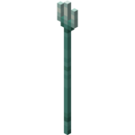

# Minecraft 武器 | 裝備 附魔查詢

### 武器

**劍**

**鋒利**、**不死剋星**、**節肢剋星**互相排斥。

| 名稱     | 最高等級 | 取得方式                                         |
| -------- | -------- | ------------------------------------------------ |
| 鋒利     | V        |  |
| 不死剋星 | V        |  |
| 節肢剋星 | V        |  |
| 掠奪     | III      |  |
| 耐久     | III      |  |
| 橫掃之刃 | III      |  |
| 燃燒     | II       |  |
| 擊退     | II       |  |
| 消失詛咒 | I        |    |
| 修補     | I        |    |

**斧** 

**絲綢之觸**和**幸運**是互斥的。

**鋒利**、**不死剋星**、**節肢剋星**互相排斥。

| 名稱     | 最高等級 | 取得方式                                         |
| -------- | -------- | ------------------------------------------------ |
| 鋒利     | V        |  |
| 不死剋星 | V        |  |
| 節肢剋星 | V        |  |
| 效率     | V        |  |
| 耐久     | III      |  |
| 幸運     | III      |  |
| 絲綢之觸 | I        |  |
| 消失詛咒 | I        |    |
| 修補     | I        |    |

**弓** 

**修補**和**無限**附魔是互斥的。

| 名稱     | 最高等級 | 取得方式                                         |
| -------- | -------- | ------------------------------------------------ |
| 強力     | V        |  |
| 耐久     | III      |  |
| 衝擊     | II       |  |
| 無限     | I        |  |
| 火焰     | I        |  |
| 消失詛咒 | I        |    |
| 修補     | I        |    |

**弩** 

**分裂箭矢**和**貫穿**附魔相互排斥。

| 名稱     | 最高等級 | 取得方式                                         |
| -------- | -------- | ------------------------------------------------ |
| 貫穿     | IV       |  |
| 快速上弦 | III      |  |
| 耐久     | III      |  |
| 分裂箭矢 | I        |  |
| 消失詛咒 | I        |    |
| 修補     | I        |    |

**三叉戟** 

**忠誠**和**喚雷**分別與**波濤**互斥，但二者不互斥。

| 名稱     | 最高等級 | 取得方式                                         |
| -------- | -------- | ------------------------------------------------ |
| 魚叉     | V        |  |
| 忠誠     | III      |  |
| 波濤     | III      |  |
| 耐久     | III      |  |
| 喚雷     | I        |  |
| 消失詛咒 | I        |    |
| 修補     | I        |    |

------

### 工具

**鎬****鏟****鋤**

**絲綢之觸**和**幸運**互相排斥。

| 名稱     | 最高等級 | 取得方式                                         |
| -------- | -------- | ------------------------------------------------ |
| 效率     | V        |  |
| 幸運     | III      |  |
| 耐久     | III      |  |
| 絲綢之觸 | I        |  |
| 消失詛咒 | I        |    |
| 修補     | I        |    |

**剪刀**

**絲綢之觸**和**幸運**互相排斥。

| 名稱     | 最高等級 | 取得方式                                         |
| -------- | -------- | ------------------------------------------------ |
| 效率     | V        |  |
| 耐久     | III      |  |
| 消失詛咒 | I        |    |
| 修補     | I        |    |

**釣竿**

| 名稱       | 最高等級 | 取得方式                                         |
| ---------- | -------- | ------------------------------------------------ |
| 魚餌       | III      |  |
| 海洋的祝福 | III      |  |
| 耐久       | III      |  |
| 消失詛咒   | I        |    |
| 修補       | I        |    |

------

### 裝備

**頭盔**

**保護**、**投射物保護**、**火焰保護**和**爆炸保護**之間是互斥的。

| 名稱       | 最高等級 | 取得方式                                         |
| ---------- | -------- | ------------------------------------------------ |
| 保護       | IV       |  |
| 火焰保護   | IV       |  |
| 爆炸保護   | IV       |  |
| 投擲物保護 | IV       |  |
| 水下呼吸   | III      |  |
| 耐久       | III      |  |
| 尖刺       | III      |    |
| 親水性     | I        |  |
| 綁定詛咒   | I        |    |
| 消失詛咒   | I        |    |
| 修補       | I        |    |

**胸甲**

**保護**、**投射物保護**、**火焰保護**和**爆炸保護**之間是互斥的。

| 名稱       | 最高等級 | 取得方式                                         |
| ---------- | -------- | ------------------------------------------------ |
| 保護       | IV       |  |
| 火焰保護   | IV       |  |
| 爆炸保護   | IV       |  |
| 投擲物保護 | IV       |  |
| 耐久       | III      |  |
| 尖刺       | III      |  |
| 綁定詛咒   | I        |    |
| 消失詛咒   | I        |    |
| 修補       | I        |    |

**護腿**

**保護**、**投射物保護**、**火焰保護**和**爆炸保護**之間是互斥的。

| 名稱       | 最高等級 | 取得方式                                         |
| ---------- | -------- | ------------------------------------------------ |
| 保護       | IV       |  |
| 火焰保護   | IV       |  |
| 爆炸保護   | IV       |  |
| 投擲物保護 | IV       |  |
| 耐久       | III      |  |
| 尖刺       | III      |    |
| 綁定詛咒   | I        |    |
| 消失詛咒   | I        |    |
| 修補       | I        |    |

**靴子**

**保護**、**投射物保護**、**火焰保護**和**爆炸保護**之間是互斥的。

**冰霜行者**和**深海漫遊**是互斥的。

| 名稱       | 最高等級 | 取得方式                                         |
| ---------- | -------- | ------------------------------------------------ |
| 保護       | IV       |  |
| 火焰保護   | IV       |  |
| 爆炸保護   | IV       |  |
| 投擲物保護 | IV       |  |
| 輕盈       | IV       |  |
| 耐久       | III      |  |
| 尖刺       | III      |    |
| 深海漫遊   | III      |  |
| 靈魂疾走   | III      |    |
| 冰霜行者   | II       |    |
| 綁定詛咒   | I        |    |
| 消失詛咒   | I        |    |
| 修補       | I        |    |

